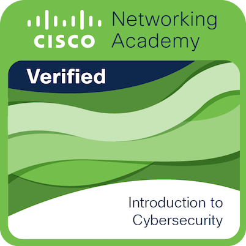

# Hello there! Welcome to my profile! 👋😄
My name is Victor, and I'm an IT student 🧑‍💻 at CEFET/RJ.
My main goal in life is to keep studying and operating professionally in the IT area, primarily in Software Development, Ethical Hacking and Cybersecurity.

## Currently Learning 📚 👨‍🎓
- Java (Intermediate/Advanced)
- Python (Intermediate)
- JavaScript (Basic/Intermediate)
- Network Security
- Cybersecurity Essentials 

## Skills and Proficiencies 📃👨‍💻

         

## Contact Me 📲📧

